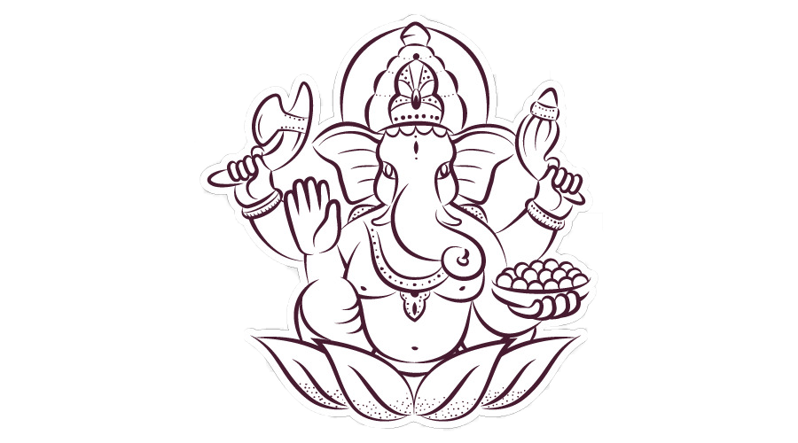

# Ganesh-Chaurthi
Ganesh Chaturthi is a vibrant Hindu festival celebrating the birth of Lord Ganesha, the elephant-headed deity of wisdom, prosperity, and good fortune. Typically observed in August or September, the festival lasts for ten days, culminating in Ganesh Visarjan, where idols are immersed in water.

---
title: Ganesh Ji
---

  

## G HAPPY GANESH CHATURTHI G

::: {.centerimg}
{width="650px"}

### Vakratund mahakay, Suryakoti samprabha Nirvighnam Kurume devam, Sarvakaryesu sarvada Happy Ganesh Chaturthi!
:::

